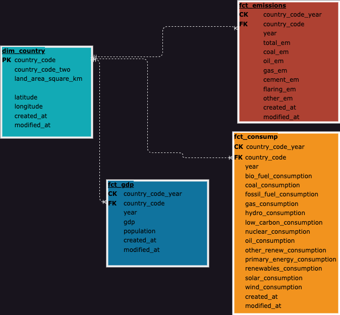

# Emissions-by-Country

#### By [Ruben Giosa](https://github.com/rgiosa10), [Reed Carter](https://github.com/Reed-Carter), [Chloe (Yen Chi) Le](https://github.com/ChloeL6)

#### This repo includes exercises for working with datasets using Python, pandas working as a team. 

<br>

## Technologies Used

* BigQuery
* Looker Studio
* Python
* SQL
* Pandas
* Git
* Markdown
* JSON
* NumPy
* `.gitignore`
* `requirements.txt`
  
</br>

## Datasets Used

1. [World Energy Consumption](https://www.kaggle.com/datasets/pralabhpoudel/world-energy-consumption)
2. [Emissions by Country](https://www.kaggle.com/datasets/thedevastator/global-fossil-co2-emissions-by-country-2002-2022)
3. [Latitude and Longitude for Every Country and State](https://www.kaggle.com/datasets/paultimothymooney/latitude-and-longitude-for-every-country-and-state)
4. [Land area (sq. km)](https://data.worldbank.org/indicator/AG.LND.TOTL.K2?view=chart)

</br>

## Description

This repo includes an ETL pipeline leveraging the different datasets highlighted above. The team began by narrowing down our datasets and then outlining our data model to then construct as a team. Below is the diagram of our data model:



<br>

### WHY Snowflake vs Star Schema:
The team debated the merits of leveraging a star schema or snowflake schema, while we acknowledged the efficiencies of a star schema that would be achieved by consolidating fact tables, we landed on a snowflake schema based on 1) size of the data sets not having a meaningful impact on performance resulting from joins and 2) organization being user friendly and intuitive.

<br>

### Architectural diagram


<br>

### Data Pipeline


<br>

### ETL Construction:
[Reed](https://github.com/Reed-Carter) constructed the `dim_country` table in the `REED.ipynb` notebook. REED performed profiling, cleaning and transformations on the [Latitude and Longitude for Every Country and State](https://www.kaggle.com/datasets/paultimothymooney/latitude-and-longitude-for-every-country-and-state) and [Land area (sq. km)](https://data.worldbank.org/indicator/AG.LND.TOTL.K2?view=chart) datasets. Upon completion it was loaded to BigQuery.

<br>

[Chloe](https://github.com/ChloeL6) worked on profiling, cleaning and transformations for the [Emissions by Country](https://www.kaggle.com/datasets/thedevastator/global-fossil-co2-emissions-by-country-2002-2022) data set create the `fct_emissions` table. Upon completion it was loaded to BigQuery.

<br>

[Ruben](https://github.com/rgiosa10) performed profiling, cleaning and transformations on the [World Energy Consumption](https://www.kaggle.com/datasets/pralabhpoudel/world-energy-consumption) to compile both the `fct_gdp` and `fct_consump` tables. Upon completion it was loaded to BigQuery. Ruben was also the lead for authoring the `README.md`

<br>

### Visualizations:
Once the datasets were cleaned and consolidated, the team created data visualizations and analysis (using Looker Studio) leveraging the constructed dimension and fact tables outlined above. 

Below is a bar and line combo graph that shows GDP compared to Population and Energy Consumption, that was put together by Ruben:

<iframe width="600" height="450" src="https://datastudio.google.com/embed/reporting/dbe92c8b-ccd3-41d9-b269-5964eb9717c3/page/f94CD" frameborder="0" style="border:0" allowfullscreen></iframe>

The scale of GDP (trillions of dollars), population (billions), and Energy consumption (thousands of kwatts) posed an issue for the visualization, but by embedding this report the user is able to see the individual values for energy consumption which shows the consistent trend that population and energy consumption growth align with the growth of GDP. Also the timeframe of 1965 through 2016 was chosen as consumption data prior to 1965 was missing and GDP data goes up to 2016.

<br>

Chloe put together a line graph plotting the global CO2 emissions over time with total emissions and each type of emission producer:

<iframe width="600" height="450" src="https://datastudio.google.com/embed/reporting/8a085df7-5101-4878-8c2c-8c6230de60d2/page/p_rh0ezxzj2c" frameborder="0" style="border:0" allowfullscreen></iframe>

<br>

Reed put together a line graph plotting the global CO2 emissions over time with total emissions and each type of emission producer:

<iframe width="600" height="450" src="https://datastudio.google.com/embed/reporting/fd52bc6a-18e7-4421-a385-c74ed91b9794/page/hpzCD" frameborder="0" style="border:0" allowfullscreen></iframe>

<br>

Overall, the team was able to limit the amount of merge conflicts by working on independent notebooks and assigning different tasks (e.g. Each focused on constructing specific dimension and fact tables, etc.).

## Setup/Installation Requirements

* Go to https://github.com/Reed-Carter/Emissions-by-Country.git to find the specific repository for this website.
* Then open your terminal. I recommend going to your Desktop directory:
    ```bash
    cd Desktop
    ```
* Then clone the repository by inputting: 
  ```bash
  git clone https://github.com/Reed-Carter/Emissions-by-Country.git
  ```
* Go to the new directory or open the directory folder on your desktop:
  ```bash
  cd Emissions-by_Country
  ```
* Once in the directory you will need to set up a virtual environment in your terminal:
  ```bash
  python3.7 -m venv venv
  ```
* Then activate the environment:
  ```bash
  source venv/bin/activate
  ```
* Install the necessary items with requirements.txt:
  ```bash
    pip install -r requirements.txt
  ```
* Download the necessary csv files listed in the Datasets Used section
* With your virtual environment now enabled with proper requirements, open the directory:
  ```bash
  code .
  ```
* Upon launch please update the Google Cloud client and project details to configure it to load to your project

</br>

## Known Bugs

* No known bugs

<br>

## License

MIT License

Copyright (c) 2022 Ruben Giosa, Alejandro Socarras, Drew White

Permission is hereby granted, free of charge, to any person obtaining a copy of this software and associated documentation files (the "Software"), to deal in the Software without restriction, including without limitation the rights to use, copy, modify, merge, publish, distribute, sublicense, and/or sell copies of the Software, and to permit persons to whom the Software is furnished to do so, subject to the following conditions:

The above copyright notice and this permission notice shall be included in all copies or substantial portions of the Software.

THE SOFTWARE IS PROVIDED "AS IS", WITHOUT WARRANTY OF ANY KIND, EXPRESS OR IMPLIED, INCLUDING BUT NOT LIMITED TO THE WARRANTIES OF MERCHANTABILITY, FITNESS FOR A PARTICULAR PURPOSE AND NONINFRINGEMENT. IN NO EVENT SHALL THE AUTHORS OR COPYRIGHT HOLDERS BE LIABLE FOR ANY CLAIM, DAMAGES OR OTHER LIABILITY, WHETHER IN AN ACTION OF CONTRACT, TORT OR OTHERWISE, ARISING FROM, OUT OF OR IN CONNECTION WITH THE SOFTWARE OR THE USE OR OTHER DEALINGS IN THE SOFTWARE.

</br>
